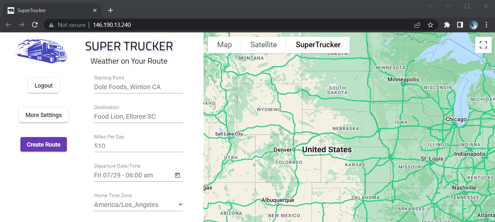
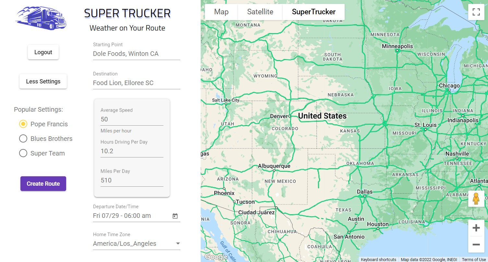
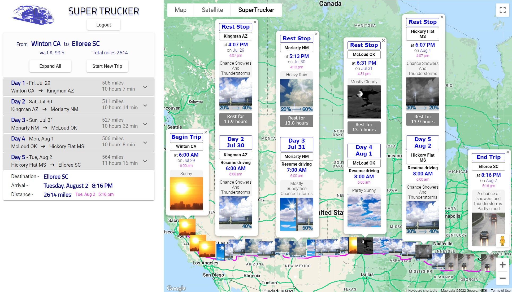
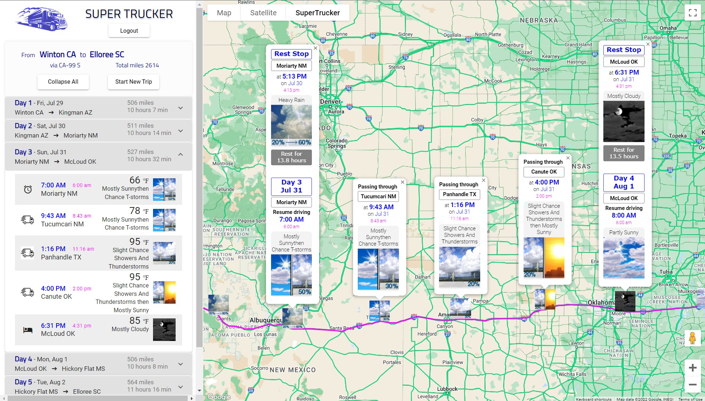
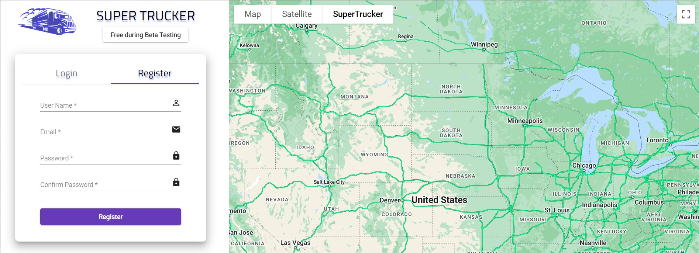
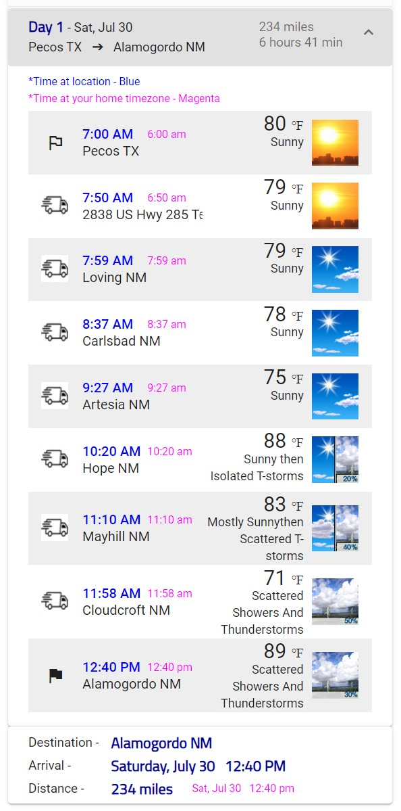

Table of Contents

- [About](#supertrucker)
- [Competitive advantage](#providing-a-competitive-advantage)
- [Tech stack](#tech-stack)
- [Under the hood](#under-the-hood)
    1. [Send trip request to server](#part-1---the-user-sends-a-trip-request)
    2. [Calculate route](#part-2---build-the-trip)
    3. [Display trip data in browser](#part-3---show-results-to-the-user)
- [Microservices architecture](#microservices-architecture)
- [Sources for weather data](#sources-for-weather-data)
- [Coming features](#features-under-development)
- [Screenshots](#screenshots)

## SuperTrucker
<table>
<tr>
<td>

- Web app for planning long-distance multi-day road trips
- The user enters the starting point, destination, and number of miles to drive each day 
- The app produces a trip route, schedule, and weather reports along the route
- [Link to deployed app](http://146.190.13.240)
</td>
</tr>
</table>

---

### Providing a competitive advantage

<table>
<tr>
<td>

- Target audience -
  - <b>Trucking Industry</b>
  -  Drivers, fleet managers, load planners
- <b>Anticipate weather delays</b>
  - This app allows you to anticipate snow and ice storms in the winter. More accurate and granular weather information can reduce the number of late deliveries. Obviously trucking companies need on-time deliveries so their customers stay happy and don't leave.

- <b>Estimate ETA quickly</b> 
  - This app provides an accurate estimate of the earliest realistic arrival time for a shipment. It allows you to quickly figure out whether an expedited delivery schedule is impossible, difficult, or just normal trucking. In the fast-paced trucking industry, the most profitable loads are available only for a very short time before being taken. By saving valuable minutes, this app allows you to secure desirable loads before your competitors.

</td>
</tr>
</table>

---

### Tech Stack

<table>
<tr>
<td>

- <b>Microservices</b> -- Docker / Kubernetes / Nginx
- <b>Front End</b> --  Angular / Google Maps
- <b>Back End</b>  --  Node / Express / MongoDb
- <b>External APIs</b> -- Google Directions / US Weather Service / Open Weather Map

</td>
</tr>
</table>

---

### Under the Hood

<table>
<tr>
<td>

#### **Part 1** - The user sends a trip request
    Gather user input and send request to server

More

At a minimum, the user must enter two locations - starting point and destination. The user has the option to enter other trip parameters - miles per hour, hours driving per day, miles per day, and/or home timezone. Trip parameters are sent in a POST request to the trip-api server.

</td>
</tr>
</table>

<table>
<tr>
<td>

#### **Part 2** - Build the trip
    Calculate route and stopping places for the trip

More

When a request comes in from the user, the trip server initially retrieves a simple route from Google Directions API, a route from starting point to destination as specified by the user. Building on this simple route, intermediate locations are added. This data is then submitted to Google Directions API to produce a route with multiple stops. However, thus far, the distances between the stops are random. A third call to Google Directions API and further calculations are needed to produce consistent distances between stops.

    Obtain and sort weather data

More

For each location on the route, the server obtains weather data for the next eight days. Weather data is gathered from two sources: Open Weather Map and US Weather Service. From this data, the app pulls out the 12-hour forecast that is relevant for each time and location on the schedule. 

While calculating the schedule and selecting relevant weather data, the server adjusts for timezones. Two times are shown for each location - 1) local time 2) time at user's home timezone. 

In the end, the data, including locations, arrival times, and relevant weather reports, is organized into sections, one for each day.

</td>
</tr>
</table>

<table>
<tr>
<td>

#### **Part 3** - Show results to the user
    Display trip information - Route, locations, times, weather

More

When the response comes back to the browser, results are displayed in two formats 
- Expandable table - consists of accordion UI elements that show or hide the details for each day
- Map - consists of a series of weather icons displayed along the highways with pop-up information windows 

The route and schedule can have up to 23 locations, with ETA for each location. For example, in [screenshot 6](#6---expanded-weather-for-one-day), the driver starts out from Pecos TX at 6 am, passes through Carlsbad NM at 8:37 am, and arrives in Alamogordo NM at 12:40 pm.

</td>
</tr>
</table>

<button >
  <a href="#anchor_on_top">Back to the Top</a>
</button>

---

### Microservices Architecture
- Consists of four microservices plus one database
- Deployed on Digital Ocean 

<table>
<tr>
<td>

1) ### **nginx**
  - Gateway that directs incoming traffic to the other microservices
  - "Reverse proxy" 
2) ### **web-mvc**
  - Frontend using Angular and Google Maps
  - Angular Material Design - UI component library 
3) ### **trip-api**
  - NodeJS server
  - Builds the route with properly spaced locations
  - Calculates the schedule with arrival times expressed in two timezones
  - Gathers weather forecasts for each location, including web-scraping
  - Pulls out the weather data for the timestamp when user is expected to be at that location
4) ### **user-api**
  - NodeJS server
  - Enables the user to register and login
  - Provides secure access using JWT tokens, Bcrypt, and Passport
5) ### **MongoDb**
  - Mongo database is deployed separately on MongoDB Atlas
  - Not deployed on Digital Ocean with the four microservices
  - This approach avoids scalability and complexity issues that may occur with a database microservice

</td>
</tr>
</table>

<button >
  <a href="#anchor_on_top">Back to the Top</a>
</button>

 
---

### Sources for Weather Data
<table>
<tr>
<td>

<b>Open Weather Map API</b>

  - provides data in 24-hour periods - midnight to midnight
  - except temperature data is in 6-hour periods 
    - Midnight to 6 am
    - 6 am to noon
    - Noon to 6 pm
    - 6 pm to midnight
  - Provides more accurate temperature data
  - Provides timezone for each location - awesome
  - Example URL
    - https://api.openweathermap.org/data/2.5/onecall?lat=35.5&lon=97.5&appid={APIkey}  
  - API key is required 

<b>US Weather Service API</b>

  - provides data in 12-hour periods - 6 am to 6 pm, 6 pm to 6 am
  - provides better icons and weather summary than Open Weather Map
  - Two separate API calls are required to get the forecast for each location 
    - First URL example ->
    - [https://api.weather.gov/points/35.5,-97.5](https://api.weather.gov/points/355,-97.5)
    - First response provides the second URL ->  
    - [https://api.weather.gov/gridpoints/OUN/97,94/forecast](https://api.weathergov/gridpoints/OUN/97,94/forecast)
    - Second URL returns the actual forecast
  - No API key is required

<b>US Weather Service HTML (web page)</b>

  - About 5% of requests to api.weather.gov fail with status 503
  - For each failed request, data is gathered from forecast.weather.gov, which is the US Weather Service consumer-facing web page
  - Th weather data is embedded in html code and must be extracted, or "scraped"
  - This data is almost the same as data from USWS API but is less complete
  - Example URL 
    - <a href="https://github.com/dec0dOS/amazing-github-template/discussions">https://forecast.weather.gov/MapClick.php?lat=35.5&lon=-97.5</a>
  - No API key is required

<b>Time limits for weather data</b>

  - US Weather Service data covers approximately the next seven days
  - Open Weather Map data covers the next eight days
  - For any times on the schedule that are beyond these time frames, the schedule tells the user, "No Weather Data for [ date ]"
  

</td>
</tr>
</table>

---

### Features under development
<table>
<tr>
<td>

<!--- - Configure DNS and nameservers to use custom URL - supertrucker.app --->
<!--- - Convert transfer protocol from http to https - for data encryption --->

- Add the ability to save a "trip template" for recurring trips
- Add the ability to find services along the route
    - Hotels
    - Truck stops
    - Repair shops and tow trucks
- Increase budget for cloud services to scale up replicas of trip-api microservice
- Create mobile version of application
- Extend the app to more countries
  - Full trip routing, scheduling, and weather is available for the entire road network of the US.
  - Unfortunately this app doesn't work for trips that are outside the road network. Sorry dog sledders and sailors.
  - Trips in Canada can be routed and scheduled. However, weather data from US government is not available in Canada which means weather forecasts are lower quality, most notably the weather icons. 
  - Trips in Mexico and other countries are not supported at this time.

</td>
</tr>
</table>

<button >
  <a href="#anchor_on_top">Back to the Top</a>
</button>

 

<table>
<tr>
<td>

### Screenshots

#### 1 - Welcome screen - Form for user input

---
#### 2 - Form with additional one-click options

---
#### 3 - Summary of trip

---
#### 4 - Details for one day

---
#### 5 - Login and register

---
#### 6 - Expanded weather for one day

</td>
</tr>
</table>

<button >
  <a href="#anchor_on_top">Back to the Top</a>
</button>

