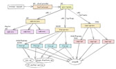
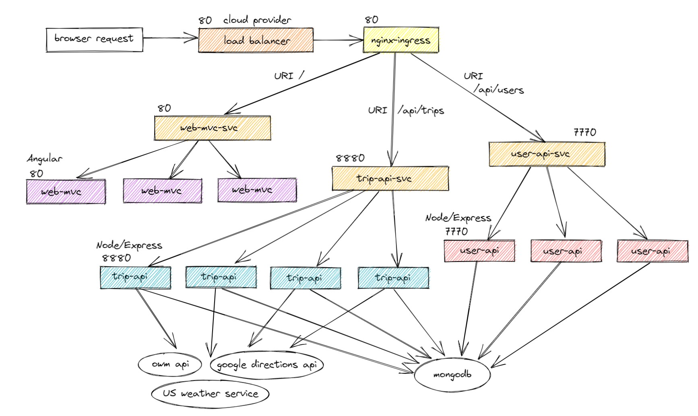
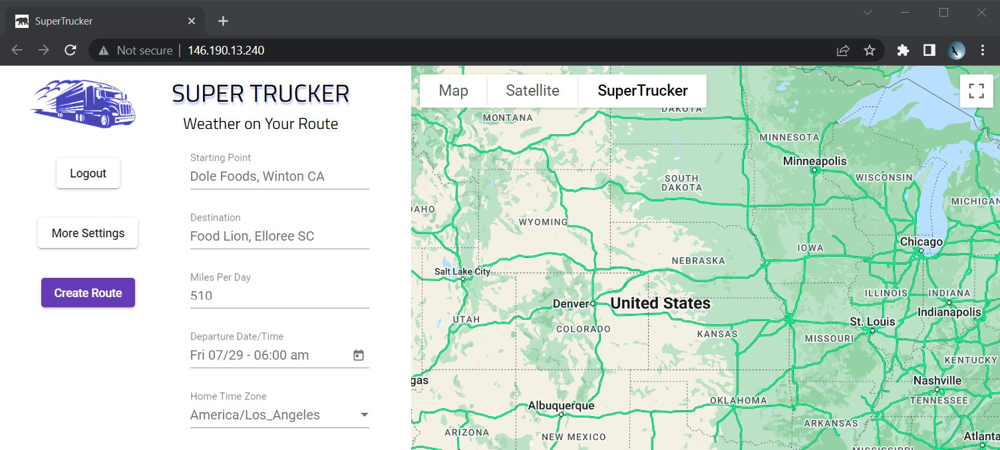
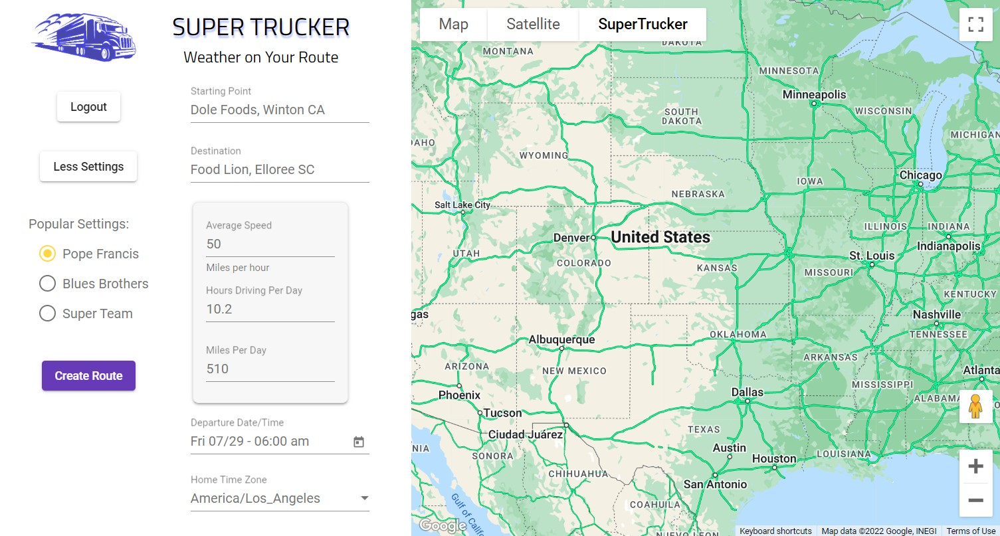
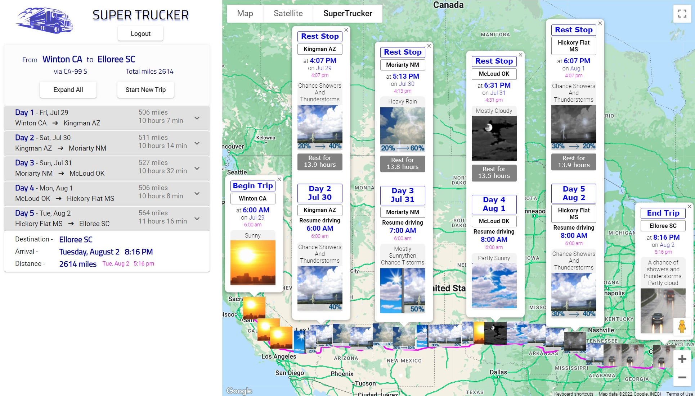
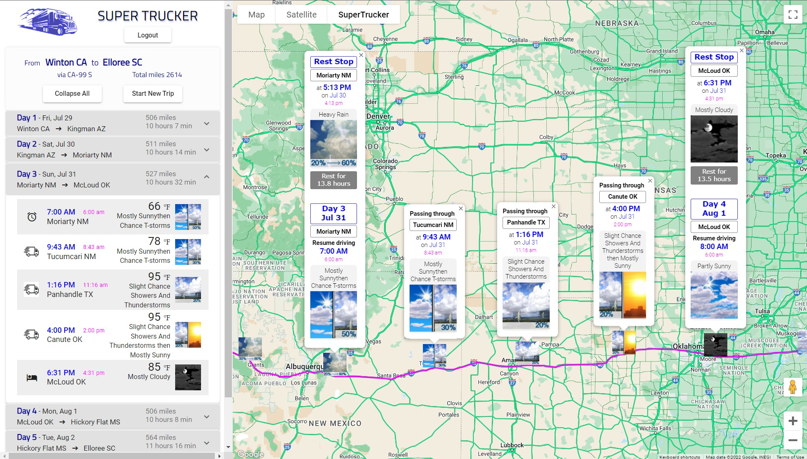
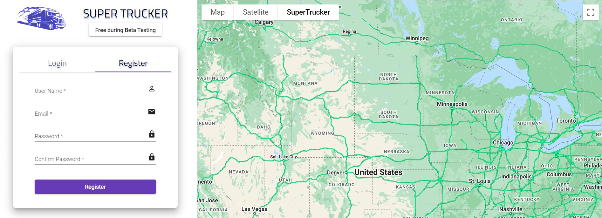
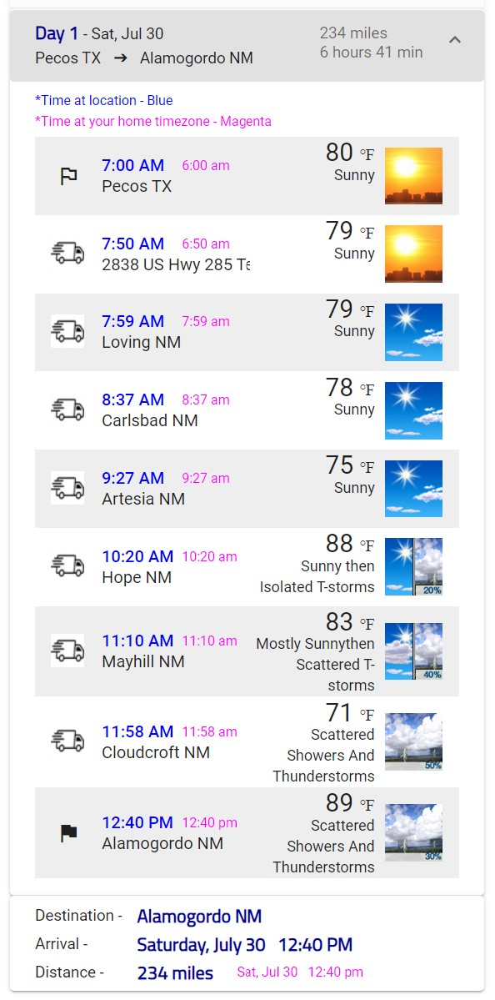

---

<button >
  <a href="https://supertrucker.app">Link to SuperTrucker.app - Beta</a>
</button>

---

<table>
<tr>
<td>

Table of Contents

- [How can this app help you?](#how-can-this-app-help-you)
- [Competitive advantage](#providing-a-competitive-advantage)
- [Tech stack](#tech-stack)
- [Under the hood](#under-the-hood)
  - [User sends trip request](#step-1---the-user-sends-a-trip-request-to-server)
  - [Calculate route](#step-2---calculate-directions-and-schedule-for-the-trip)
  - [Gather weather data](#step-3---gather-weather-data-for-each-location-on-route)
  - [Display trip schedule in browser](#step-4---display-the-trip-schedule-for-the-user)
- [Containers & Microservices](#containers---microservices)
- [Sources for weather data](#sources-for-weather-data)
- [What's next for this project?](#whats-next-wish-list-for-additional-features)
- [Screenshots](#screenshots)

</td>
</tr>
</table>

---

## How can this app help you?

<table>
<tr>
<td>

- SuperTrucker is for planning long-distance multi-day road trips
- The user enters starting point, destination, and number of miles to drive each day
- The app produces a trip route, schedule, and weather reports along the route

</td>
</tr>
</table>

### :chart_with_upwards_trend:

## Providing a Competitive Advantage

<table>
<tr>
<td>

### :truck: &nbsp;Target audience

- Trucking industry
- Drivers / Fleet managers / Load planners

### :snowflake: &nbsp;Anticipate weather delays

- This app helps you to anticipate snow and ice storms during winter. More accurate and high resolution weather information can reduce the number of late deliveries.

### :alarm_clock: &nbsp;Estimate ETA quickly

- This app provides an accurate estimate of the earliest realistic arrival time for a shipment. It allows you to quickly figure out whether an expedited delivery schedule is impossible, difficult, or just normal trucking.

- The most profitable loads are available only for a very short time before being taken. By saving valuable minutes, this app allows you to secure desirable loads before your competitors.

</td>
</tr>
</table>

## Tech Stack

<table>
<tr>
<td>

- <b>Containers</b> -- Docker / Kubernetes
- <b>Front End</b> -- Angular / Google Maps
- <b>Back End</b> -- Node / Express / MongoDb
- <b>External APIs</b> -- Google Directions / US Weather Service / Open Weather Map

</td>
</tr>
</table>

### &nbsp; :wrench: :hammer:

## Under the Hood

<table>
<tr>
<td>

### Step 1 - The user sends a trip request to server

### :white_check_mark:

- At a minimum, the user must enter -
  - Starting point
  - Destination
- The user can modify other settings for the trip -
  - Miles per hour
  - Hours driving per day
  - Miles per day
  - Home timezone
- The user's input is sent in a POST request to the trip-api server

</td>
</tr>
</table>

<table>
<tr>
<td>

### Step 2 - Calculate directions and schedule for the trip

### :white_check_mark:

- When a trip request comes in, the server initially retrieves a simple route from Google Directions API, that is, a route from starting point to destination as specified by the user
- Building on this simple route, intermediate locations are added
- This series of locations is then submitted to Google Directions API to produce a route with multiple stops
- However, thus far, the distances between the stops are random. Further calculations plus one or more calls to Google Directions API are needed to adjust the stops so that they are evenly spaced along the route
- The schedule for the trip is calculated based on user input or default values for -

  - Starting date and time
  - Miles per hour
  - Hours driving per day

- The route and schedule can show as many as 24 locations with ETA for each location

</td>
</tr>
</table>

<table>
<tr>
<td>

### Step 3 - Gather weather data for each location on route

### :white_check_mark:

- For each location on the route, the server gathers weather data from:
  - Open Weather Map
  - US Weather Service
- Gathering weather data for a multi-day trip may require more than 70 requests

- A series of weather data points is selected, each one matches a time and location on the schedule

- Times on the schedule are calculated for two timezones -

  - Local time for location on schedule
  - Time for user's home timezone

- Data is also organized into sections, one for each day

</td>
</tr>
</table>

<table>
<tr>
<td>

### Step 4 - Display the trip schedule for the user

### :white_check_mark:

- The trip schedule is displayed in two formats

  - Map with a series of weather icons displayed along the highways with pop-up information windows
    - [Example screenshot - Map with weather](#2---summary-of-trip)
  - Expandable table - a set of accordion UI elements that show or hide the details for each day
    - [Example screenshot - Schedule for a day](#5---schedule-for-one-day-expanded-to-show-weather-along-the-route)

</td>
</tr>
</table>

<button >
  <a href="#anchor_on_top">Back to the Top</a>
</button>

## Containers - Microservices

- Four containers and one database
- Built with Docker and Kubernetes
- Deployed on Digital Ocean

See flow chart of Kubernetes containers and services  

<table>
<tr>
<td>

</td>
</tr>
</table>

<table>
<tr>
<td>

### **nginx-ingress** &nbsp;

- Secure entry point that directs traffic to internal services
- All further traffic and responses are encrypted - HTTPS / TLS / SSL

### **web-mvc** &nbsp;

- Web framework by Angular
- Angular Material Design - UI library
- Google Map

### **trip-api** &nbsp;

- Express server running on NodeJS
- Creates a trip route with properly spaced locations
- Calculates the schedule with arrival times expressed in two timezones
- Gathers weather forecasts for each location, including web-scraping
- Pulls out weather data for the timestamp when user is scheduled to be at that location

### **user-api** &nbsp;

- Express server running on NodeJS
- Allows the user to register and login
- Provides secure access using JWT tokens, Bcrypt, and Passport

### **MongoDb** &nbsp;

- Mongo database is deployed separately on MongoDB Atlas

</td>
</tr>
</table>

<button >
  <a href="#anchor_on_top">Back to the Top</a>
</button>

### &nbsp; :sunny: :umbrella: :snowflake:

## Sources for Weather Data

<table>
<tr>
<td>

<b>Open Weather Map API</b>

---

- Provides most data in 24-hour periods - midnight to midnight
- except temperature data is in 6-hour periods -
  - Midnight to 6 am
  - 6 am to noon
  - Noon to 6 pm
  - 6 pm to midnight
- Temperature data is superior to other sources because of the better resolution (6 hour periods)
- Provides timezone for each location - awesome
- Example URL
  - https://api.openweathermap.org/data/2.5/onecall?lat=35.5&lon=97.5&appid={APIkey}
- API key is required

---

<b>US Weather Service API</b>

---

- provides data in 12-hour periods -
  - 6 am to 6 pm
  - 6 pm to 6 am
- provides better icons and weather summary compared to Open Weather Map
- Two separate API calls are required to obtain forecast for each location
  - First URL example ->
  - [https://api.weather.gov/points/35.5,-97.5](https://api.weather.gov/points/35.5,-97.5)
  - First response provides the second URL ->
  - [https://api.weather.gov/gridpoints/OUN/97,94/forecast](https://api.weathergov/gridpoints/OUN/97,94/forecast)
  - Second URL returns the actual forecast (except when the weather server returns an error)
- No API key is required

---

<b>US Weather Service HTML (web page) &nbsp; </b>

---

- About 5% of requests to api.weather.gov fail with status 500 or 503
- For each failed request, data is gathered from forecast.weather.gov, which is the US Weather Service consumer-facing web page
- The weather data is embedded in html code and must be extracted, or "scraped"
- This data is almost the same as data from USWS API but is less complete
- Example URL
  - <a href="https://forecast.weather.gov/MapClick.php?lat=35.5&lon=-97.5">https://forecast.weather.gov/MapClick.php?lat=35.5&lon=-97.5</a>
- No API key is required

---

<b>Time limitations for weather data</b>

- US Weather Service data covers approximately the next seven days
- Open Weather Map data covers the next eight days
- For any times on the schedule that are beyond these time frames, the schedule informs the user, "No Weather Data for [ date ]"

</td>
</tr>
</table>

### &nbsp; :rocket:

## What's next? &nbsp;Wish list for additional features

<table>
<tr>
<td>

- Convert the frontend to React / Redux to facilitate advanced features
- Add the ability to save a "trip template" for recurring trips
- Add the ability to find services along the route such as -
  - Hotels
  - Truck stops
  - Repair shops and tow trucks
- Research target audience to learn how the app can better serve them
- Implement advertising, subscriptions, or other monetization strategies
- Fix login and register capabilities which broke along the way :)
- Create mobile version of application
- Extend the app to more countries
  - At this time, trip data is only available for the US and Canada
  - Mexico is the next target
  - Need to upgrade to higher quality weather data for Canada

</td>
</tr>
</table>

<button >
  <a href="#anchor_on_top">Back to the Top</a>
</button>

 

<table>
<tr>
<td>

## Screenshots

#### 1 - Welcome screen - Form for user input

---

#### 2 - Welcome screen - Expanded to show one-click options

---

#### 3 - Summary of trip

---

#### 4 - Details for one day

---

#### 5 - Login and register

---

#### 6 - Schedule for one day

- Displayed in table format
- Expanded to show weather along route

</td>
</tr>
</table>

<button >
  <a href="#anchor_on_top">Back to the Top</a>
</button>

